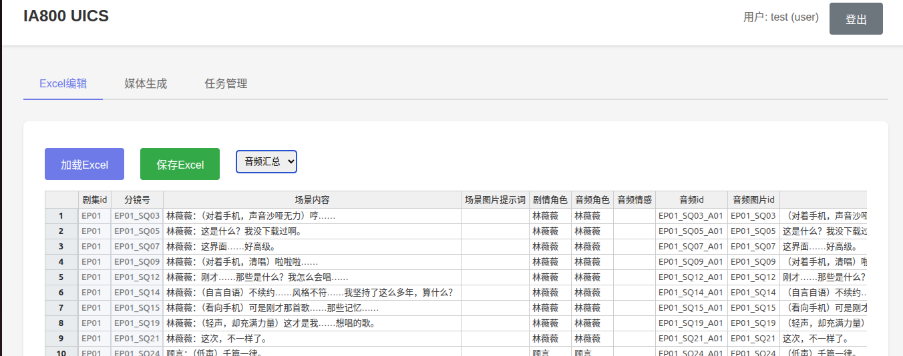
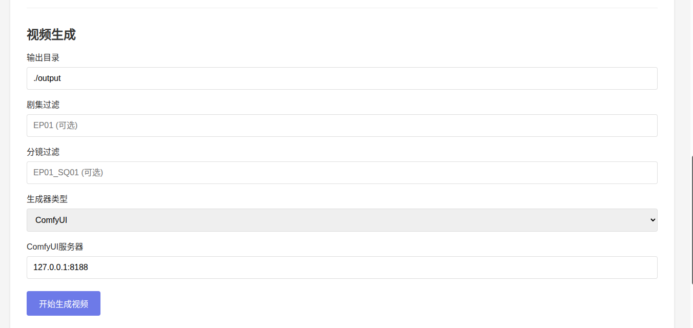
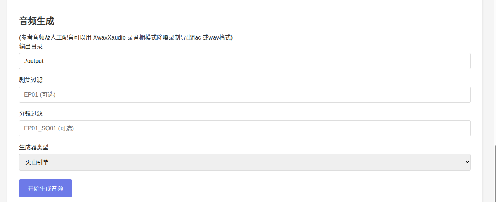

# UICS - Excel编辑 与Ai短剧漫剧AIGC批量生成工具

## 概述

UICS (Unified Intelligent Content System) 是基于 FastAPI 的 Web 多用户系统，支持：

- Excel 文件（`all_episodes.xlsx`）的在线查看与编辑
- 图片、视频、音频及数字人视频/数字人声的批量生成
- 多用户与任务管理、实时进度与预览刷新

## 文档索引

| 文档 | 说明 |
|------|------|
| [安装与运行](docs/安装与运行.md) | 环境要求、依赖安装、首次运行、启动方式 |
| [系统说明](docs/系统说明.md) | 功能模块、技术栈、目录结构、API 与扩展说明 |
| [ComfyUI 工作流与模型](docs/ComfyUI工作流与模型.md) | UICS 中使用的 ComfyUI 工作流 JSON 与对应功能 |
| [使用数据说明](docs/使用数据说明.md) | 音频/图片/视频生成的输入参数与 Excel 数据来源（表与列） |
| [QUICKSTART.md](QUICKSTART.md) | 快速上手步骤 |
| [DEPLOY.md](DEPLOY.md) | 单独部署到其他机器（含 lib 复制） |

## 快速开始

```bash
# 1. 进入 UICS 目录
cd UICS

# 2. 安装依赖
pip install -r requirements.txt

# 3. （可选）若需单独部署，在项目根目录执行一次：
#    python UICS/scripts/copy_deps.py

# 4. 启动服务
python server.py
# 或: uvicorn server:app --host 0.0.0.0 --port 5000
# 或: ./start.sh
```

浏览器访问：**http://localhost:5000**  
默认管理员：`admin` / `admin123`

使用 ComfyUI 生成图片/视频/数字人声前，请先启动 ComfyUI 并准备模型。具体步骤见：[ComfyUI 工作流与模型](docs/ComfyUI工作流与模型.md)。




## 功能概览

- **Excel 编辑**：加载/保存 Excel，多工作表编辑（Handsontable）
- **图片生成**：ComfyUI / Nano Banana，支持参考图、首末帧
- **视频生成**：ComfyUI（i2v/i2vse）或 Sora
- **数字人视频生成**：单图 + 对应分镜音频，s2v 工作流
- **音频生成**：火山引擎 TTS 或 ComfyUI (Qwen3-TTS)
- **数字人声生成**：固定 ComfyUI Qwen3-TTS
- **任务管理**：任务列表、进度、结果与预览刷新

## 技术栈

- **后端**：FastAPI、Uvicorn、Pandas、OpenPyXL、Passlib、WebSocket
- **前端**：Vue 3、Handsontable、原生 WebSocket

## 目录结构

```
UICS/
├── server.py           # FastAPI 主程序
├── requirements.txt    # Python 依赖
├── start.sh            # 启动脚本
├── all_episodes.xlsx   # 默认 Excel（可替换）
├── lib/                # 运行依赖（copy_deps.py 生成，用于单独部署）
├── scripts/
│   └── copy_deps.py    # 复制依赖到 lib
├── templates/
│   └── index.html
├── static/
│   ├── css/
│   └── js/
├── uploads/
├── output/             # 生成文件输出
├── users.json          # 用户数据（可选）
├── README.md           # 本文件
├── QUICKSTART.md
├── DEPLOY.md
└── docs/
    ├── 安装与运行.md
    └── 系统说明.md
```

## 配置说明

- **Excel 路径**：默认 `UICS/all_episodes.xlsx`，可在 `server.py` 中修改 `EXCEL_FILE`
- **输出目录**：默认 `UICS/output`（`OUTPUT_FOLDER`）
- **密钥**：生产环境请修改 `SECRET_KEY`
## 输入excel标准格式
all_episodes.xlsx
[标准格式说明](docs/all_episodes.xlsx标准格式说明.md)
## API 文档

- Swagger UI：http://localhost:5000/docs  
- ReDoc：http://localhost:5000/redoc  

## 许可证

MIT License
